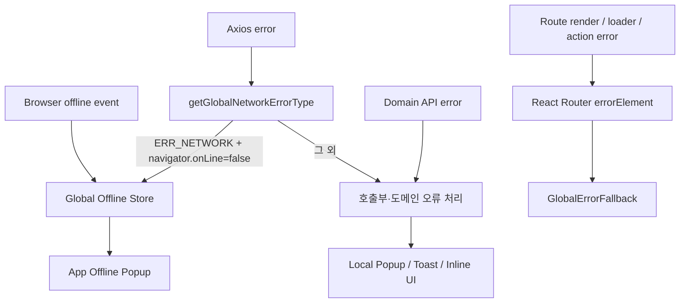

# 전역 오류 처리 가이드

> 이 문서는 전역 offline 처리, 도메인 오류 처리, route fallback의 책임 경계와 확장 원칙을 팀에 공유하기 위한 기준 문서다.

## 1. 목적

이 프로젝트의 전역 오류 처리는 모든 오류를 중앙에서 처리하기 위한 구조가 아니다.

다음 원칙을 따른다.

- 앱 전체에 영향을 주는 오류만 전역 UI에서 처리한다.
- API나 기능의 문맥이 필요한 오류는 해당 호출부 또는 도메인에서 처리한다.
- 인터셉터는 비즈니스 메시지나 팝업 구성을 결정하지 않는다.
- 전역 UI 표시와 호출부의 Promise 실패 인지는 분리한다.
- 사용자 fallback과 운영 오류 수집은 서로 다른 책임으로 관리한다.

## 2. 현재 구조



### 전역 UI 처리 범위

| 상황 | 전역 UI | 처리 위치 |
| --- | --- | --- |
| 브라우저 `offline` 이벤트 | O | `useGlobalNetworkStatus` → offline store |
| `ERR_NETWORK`이며 `navigator.onLine === false` | O | Axios interceptor → offline store |
| `navigator.onLine !== false`인 `ERR_NETWORK` | X | 호출부 fallback |
| `ERR_CANCELED` | X | 사용자 오류 UI 없음 |
| `ECONNABORTED`, `ETIMEDOUT` | X | 요청별 호출부 |
| HTTP 4xx/5xx | X | 도메인 호출부 |
| React Router 내부 render/loader/action 오류 | fallback | 루트 `errorElement` |

## 3. 파일별 책임

| 파일 | 책임 |
| --- | --- |
| `src/utils/getGlobalNetworkErrorType.ts` | Axios 오류가 전역 offline 대상인지 순수 판별 |
| `src/store/useGlobalOfflineStore.ts` | 전역 팝업에 필요한 `isOffline` boolean만 관리 |
| `src/hooks/useGlobalNetworkStatus.ts` | 초기 브라우저 상태 동기화 및 online/offline 이벤트 구독 |
| `src/api/axiosInstance.ts` | offline 판별 결과를 store로 전달하고 원본 rejection 유지 |
| `src/App.tsx` | offline store 구독 및 전역 팝업 렌더링 |
| `src/components/GlobalErrorFallback.tsx` | React Router에서 전달한 오류의 최종 fallback UI |
| `src/router/router.tsx` | 루트 라우트의 `errorElement` 연결 |

## 4. Offline 처리 상세

### 판별 조건

`getGlobalNetworkErrorType`은 다음 조건을 모두 만족할 때만 `offline`을 반환한다.

1. Axios 오류다.
2. 요청 취소가 아니다.
3. timeout이 아니다.
4. HTTP 응답이 존재하지 않는다.
5. Axios code가 `ERR_NETWORK`다.
6. 호출 시 전달한 online 상태가 `false`다.

`navigator.onLine === true`는 실제 서버 연결 성공을 의미하지 않는다. 따라서 true인 상태의 `ERR_NETWORK`는 DNS, CORS, 인증서, 프록시 또는 일시적 장애일 수 있으며 전역 offline 팝업으로 분류하지 않는다.

### Store와 중복 방지

offline store에는 요청 정보나 오류 배열을 저장하지 않는다.

```ts
type GlobalOfflineState = {
  isOffline: boolean;
  setOffline: () => void;
  clearOffline: () => void;
};
```

여러 요청이 동시에 실패해도 같은 boolean만 갱신하므로 팝업 인스턴스가 요청 수만큼 생성되지 않는다.

### Online 복구

- `window.online` 이벤트에서 offline 상태를 해제한다.
- 사용자가 `다시 확인`을 누르면 `navigator.onLine`만 다시 확인한다.
- health check API를 호출하지 않는다.
- Axios interceptor는 실패한 요청을 자동 재실행하지 않는다.
- POST, PATCH, DELETE mutation을 offline 복구 후 전역 레이어에서 재실행하지 않는다.

단, 현재 `QueryClient`는 별도 `defaultOptions` 없이 생성된다. TanStack Query의 기본 정책에 따라 활성 query는 reconnect 시 다시 조회될 수 있다. 이는 전역 offline 처리의 요청 재실행이 아니라 서버 상태 query의 기본 reconnect 동작이다. mutation은 전역 레이어에서 재실행하지 않는다.

## 5. 로컬 오류 UI 중복 방지

전역 offline으로 분류된 오류는 로컬 팝업보다 먼저 제외한다.

```ts
if (shouldSkipLocalErrorUI(error, navigator.onLine)) return;
```

현재 적용 지점은 다음과 같다.

- `src/pages/community/hooks/useCommunityErrorPopup.ts`
- `src/pages/home/NotificationPage.tsx`
- `src/pages/alumni/ProfilePage.tsx`
- `src/pages/alumni/portfolio/AlumniPortfolioListPage.tsx`

새로운 로컬 fallback을 추가할 때도 다음 순서를 유지한다.

1. 취소 요청 제외
2. 전역 offline 대상 제외
3. 서버 오류 코드 또는 HTTP 상태 판별
4. 도메인 UI 표시

`shouldSkipLocalErrorUI`는 offline만 제외한다. timeout, online 상태의 일반 `ERR_NETWORK`, HTTP 오류는 기존 호출부 정책을 유지한다.

## 6. GlobalErrorFallback 안정성

### 의존성 감사 결과

`GlobalErrorFallback`의 직접 import는 다음 두 개뿐이다.

- React의 `useEffect`
- React Router의 `isRouteErrorResponse`, `useRouteError`

다음 프로젝트 레이어에는 의존하지 않는다.

- Zustand store
- 프로젝트 custom hook
- Axios 또는 API client
- 인증 상태
- TanStack Query
- WebSocket
- 공통 팝업 컴포넌트
- 도메인별 오류 상수 또는 오류 코드

App 자체가 렌더링 중 실패한 경우에도 fallback이 함께 실패하지 않도록 버튼을 기본 HTML 요소로 구성했다. 전역 CSS와 Tailwind 디자인 토큰은 시각 표현에만 사용하며, 스타일 로딩에 문제가 있어도 제목·설명·기본 버튼 동작은 DOM에 남는다.

### 표시 정책

- 404 route error: 페이지를 찾을 수 없다는 안내와 홈 이동 제공
- 그 외 route render/loader/action 오류: 일반 오류 안내, 새로고침, 홈 이동 제공
- stack trace와 원본 오류 메시지는 사용자에게 노출하지 않음
- 개발 환경의 예상하지 못한 오류만 console에 기록
- 예상 가능한 404는 runtime 오류 로그에서 제외
- 홈 이동은 `import.meta.env.BASE_URL`을 사용해 배포 base 경로를 따름

### Error Boundary가 잡지 못하는 오류

React Router의 `errorElement`가 모든 JavaScript 오류를 처리하지는 않는다.

- 이벤트 핸들러 내부에서 발생하고 별도로 throw되지 않은 오류
- `setTimeout` 같은 비동기 callback 오류
- 처리되지 않은 Promise rejection
- RouterProvider 바깥의 `QueryClientProvider` 또는 앱 bootstrap 오류
- API 실패 자체

이 오류들은 사용자 fallback과 별개로 observability 정책에서 다뤄야 한다. API 오류를 Error Boundary로 보내기 위해 TanStack Query의 `throwOnError`를 전역 활성화하지 않는다. 필요한 query에서만 명시적으로 판단한다.

## 7. Error Boundary 확장 규칙

- fallback에서 store, 인증 hook, API 요청을 호출하지 않는다.
- fallback에서 서버 오류 코드나 도메인 메시지를 해석하지 않는다.
- 오류 화면 진입 시 mutation을 자동 재실행하지 않는다.
- 복구 기능은 새로고침 또는 안전한 루트 이동처럼 단순하게 유지한다.
- fallback 자체에 새로운 공통 UI 의존성을 추가할 때는 해당 컴포넌트의 hook/store/API 의존성을 먼저 확인한다.
- `main.tsx`의 RouterProvider 바깥 Boundary는 실제 필요성과 fallback 중복 정책을 정한 뒤 별도 작업으로 도입한다.

## 8. Observability 도입 방향

Sentry 등을 도입할 때 사용자 UI 표시 정책과 오류 수집 정책을 분리한다.

우선 수집 후보:

- Error Boundary가 잡은 예상하지 못한 runtime 오류
- component stack
- 현재 route
- 배포 환경, release/version
- correlation/request ID
- 비식별 사용자 ID

기본 제외 후보:

- 예상된 도메인 오류
- 404 route error
- `ERR_CANCELED`
- 반복되는 offline 오류
- access/refresh token
- 비밀번호와 사용자 입력값
- 요청·응답 전체 body

fallback 컴포넌트가 Sentry SDK에 직접 의존하지 않도록 Error Boundary와 로깅 어댑터의 책임을 분리하는 방식을 우선 검토한다.

## 9. 검증 체크리스트

### Offline

- [ ] 앱 시작 당시 offline이면 팝업이 표시된다.
- [ ] 여러 API가 실패해도 팝업은 하나만 표시된다.
- [ ] 전역 offline 팝업과 로컬 오류 팝업이 중복되지 않는다.
- [ ] online 복구 시 팝업이 자동 종료된다.
- [ ] offline 재진입 시 다시 표시된다.
- [ ] 복구 시 mutation을 전역 레이어가 자동 재실행하지 않는다.

### Error fallback

- [ ] 존재하지 않는 경로에서 404 fallback이 표시된다.
- [ ] route component render 오류에서 일반 fallback이 표시된다.
- [ ] 사용자 화면에 원본 error와 stack이 노출되지 않는다.
- [ ] 새로고침 버튼이 현재 URL을 다시 로드한다.
- [ ] 홈 이동 버튼이 배포 base 경로로 이동한다.
- [ ] fallback 렌더링 중 store, API, socket 요청이 발생하지 않는다.

### 정적 검사

```bash
npm run lint
npm run build
```

브라우저 동작 검증은 작업 요청 범위에 포함된 경우에만 진행한다.

## 10. 알려진 후속 과제

1. RouterProvider 바깥 bootstrap 오류에 대한 최상위 Boundary 필요성 판단
2. Sentry 또는 다른 error logger 도입 정책 확정
3. source map과 release 관리 방식 확정
4. 민감정보 필터링 및 오류 샘플링 정책 확정
5. 서비스 점검과 세션 만료의 전역 처리 여부 별도 결정
